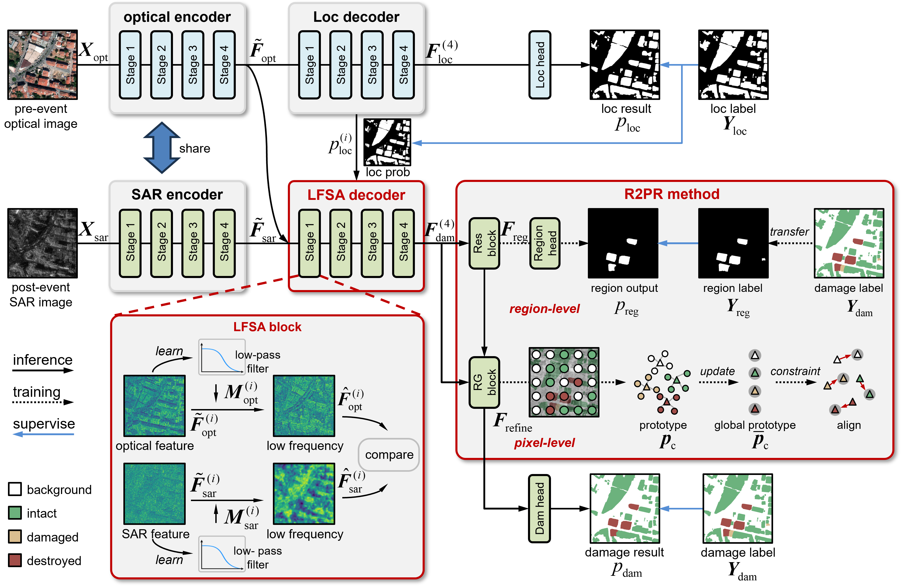
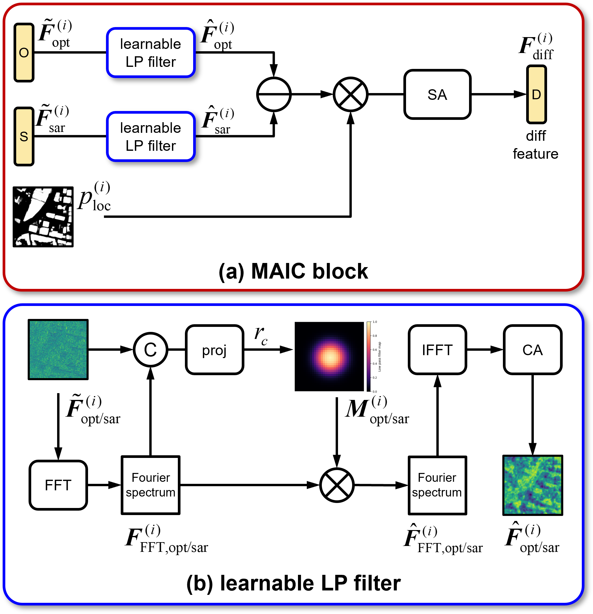
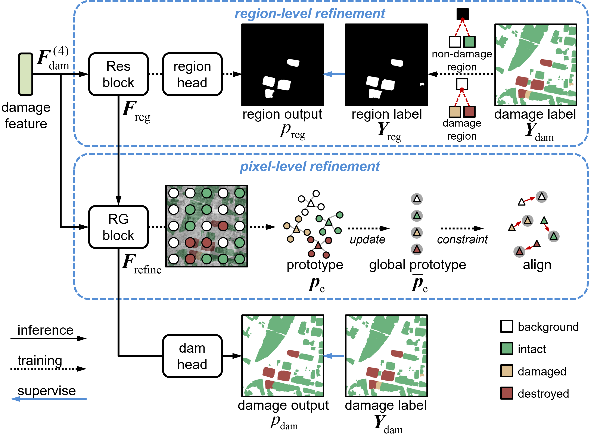

# Low-frequency guided region-to-pixel refinement network for multimodal building damage assessment

<p align="center">
  <a href="https://www.python.org/"></a>
  <a href="LICENSE"></a>
</p>

## Table of Contents

- [Abstract](#abstract)
- [Overview](#overview)
  - [Pipeline](#pipeline)
  - [MAIC Block](#maic-block)
  - [R2PR Method](#r2pr-method)
- [Getting Started](#getting-started)
  - [Requirements](#requirements)
  - [Training on Bright Dataset](#training-on-bright-dataset)
  - [Trained Model](#trained-model)
  - [Evaluation on Bright Dataset](#evaluation-on-bright-dataset)
- [Acknowledgment](#acknowledgment)

## Abstract

Disasters can cause damage to buildings and inflict catastrophic losses on human life and property.
To achieve all-weather and all-day responses, multimodal building damage assessment (BDA) using pre-event optical and post-event synthetic aperture radar (SAR) images has become a pivotal research direction.
Current methods mainly focus on designing and improving nonlinear comparison operators to analyze multimodal features for damage classification.
However, multimodal feature heterogeneity leads to reduced comparability between optical and SAR features, posing a significant obstacle to accurate damage classification.
To solve this problem, a low-frequency guided modality-agnostic information comparison (MAIC) block is proposed, where learnable low-frequency filters are designed to explore modality-agnostic semantic information from optical and SAR features, thereby bridging the modality gap.
Based on the block, an MAIC decoder is designed to hierarchically aggregate damage cues, thereby acquiring representative damage features.
Then, to address the difficulty of identifying damage categories under complex backgrounds and diverse feature distributions, a region-to-pixel refinement (R2PR) method is proposed to enhance the discriminability of damage features.
This method introduces damage-region priors and aligns pixel-wise damage features with global dynamic prototypes, to improve feature discriminability across different damage categories.
Combining the MAIC decoder and R2PR method, a low-frequency guided region-to-pixel refinement network (LFR2P-Net) is proposed to bridge the cross-modal discrepancy and obtain representative damage features with high discriminability, thereby alleviating the difficulty in BDA under multimodal heterogeneity.
The proposed LFR2P-Net achieves an improvement of 1.20% in mIoU on the Bright dataset, demonstrating its effectiveness.

## Overview

### Pipeline

<p align="center">
  
</p>

### MAIC Block

<p align="center">
  
</p>

### R2PR Method

<p align="center">
  
</p>

## Getting Started

### Requirements

Install the dependencies with:

```bash
pip install -r requirements.txt
```

The code depends on `selective_scan==0.0.2`, and the source file is located in `core/models/vmamba/kernels`.
For detailed instructions on compiling, please refer to the VMamba repository:

- [VMamba Paper](https://arxiv.org/abs/2401.10166)
- [VMamba GitHub Repository](https://github.com/MzeroMiko/VMamba)

### Training on Bright Dataset

The pretrained VMamba backbone is released in [VMamba](https://github.com/MzeroMiko/VMamba).
You can also download pretrained models from Google Drive as follows.

| Encoder     | Pretrained on | File                                  | Link                                                                                              |
| ----------- | ------------- | ------------------------------------- | ------------------------------------------------------------------------------------------------- |
| VMamba-Tiny | ImageNet-1K   | `vssm_tiny_0230_ckpt_epoch_262.pth` | [Google Drive](https://drive.google.com/file/d/13vCKVgGTYsjFMsYQlDIyxAtbxQGRsoNq/view?usp=sharing) |

Download the encoder weights and update the `pretrained_weights` path in your config file:

```yaml
# cfgs/bright_bs8_lfr2p-net_vmt.yaml
MODEL:
    pretrained_weights: '/path/to/vssm_tiny_0230_ckpt_epoch_262.pth'
```

To train the model on the Bright dataset, use the following command:

```bash
python3 engine/train_val.py --config cfgs/bright_bs8_lfr2p-net_vmt.yaml
```

### Trained Model
The trained model will be released upon paper acceptance.
| Encoder     | File               | mIoU  | Link |
| ----------- |--------------------| ----- | ---- |
| VMamba-Tiny | `ckpt_vmt.pth.tar` | 70.08 |      |

### Evaluation on Bright Dataset

To evaluate a trained checkpoint, run:

```bash
python3 engine/test.py --config cfgs/bright_bs8_lfr2p-net_vmt.yaml --ckpt path/to/checkpoint.pth.tar
```

Arguments:
- `--config`: path to the YAML config file (same as training).
- `--ckpt`: path to the trained checkpoint produced by training.

By default, evaluation prints per-class IoU and mIoU, and reports per-disaster-event and per-disaster-type metrics. To also save the predictions, set `TEST.SAVE_PRED: True` and/or `TEST.SAVE_VIS: True` in the config file; the results are written under the config directory in `test_results/`.

## Acknowledgment

This project is based on the following works:

- BRIGHT dataset ([Paper](https://essd.copernicus.org/articles/17/6217/2025/essd-17-6217-2025.html), [Github Code](https://github.com/ChenHongruixuan/BRIGHT))
- Segmentation Models Pytorch ([Github Code](https://github.com/qubvel-org/segmentation_models.pytorch))
- VMamba ([Paper](https://arxiv.org/abs/2401.10166), [Github Code](https://github.com/MzeroMiko/VMamba))

Thanks for their excellent works.

[//]: #
[//]: #
[//]: #
[//]: #
[//]: #
[//]: #
[//]: #
